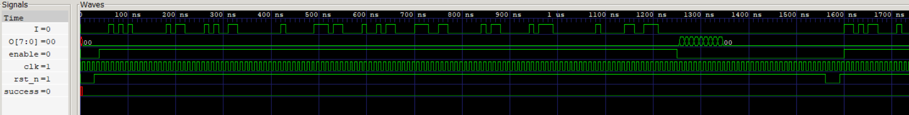
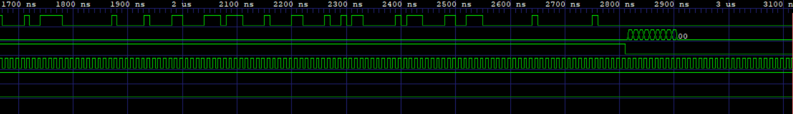

# ASIC puzzle 2026 Jane Street

## GDS file
First I checked the `puzzle.gds` file using KLayout 0.30.12 and I noticed several things:
- opening the Dysplay/Cells tab all instances had very specific names, such as `sky130_fd_sc_hd__dfrtp_2`, `sky130_fd_sc_hd__nand2_2`, etc...
- all input and output pin lable were present
- checking the layers, the ones that count are li1 (67/20), met1 (68/20), met2 (69/20), met3 (70/20), met4 (71/20), met5 (72/20), and the cuts of via mcon (67/44), via (68/44), via2 (69/44), via3 (70/44), via4 (71/44)

This made me realize that the right path was to extract the netlist and not look for a pattern in the geometry.

### Cell Naming Convention

The standard cell name `sky130_fd_sc_hd__dfrtp_2` means:

| Field | Meaning |
|---|---|
| `sky130` | SkyWater SKY130 technology |
| `fd` | Foundry device |
| `sc` | Standard cell |
| `hd` | High density library |
| `__` | Separates the library name from the cell name |
| `dfrtp` | D flip flop with asynchronous reset and positive clock edge |
| `_2` | Drive strength 2 |

In other words, `sky130_fd_sc_hd__dfrtp_2` is a **high density SKY130 standard cell implementing a D flip flop with asynchronous reset, using drive strength 2**.

<br>

## VCD file
I decided to look at the `example_inputs.vcd`file using GTKWave:

- At first `rst_n` is low for a few clk cycle, then it goes high.
- Then `enable` goes high and stays high for a long window, while `I` changes with each clock stroke. Counting the clock strokes with enable high you find that it is 121 bits.
- When `enable` goes low again, O starts producing value: TRY AGAIN in ASCII code.
- `success` stays at 0: that's the signal you need to make 1.


So the protocol is: reset, then 121 cycles with high enable and one bit on I per cycle (first cycle = MSB) then low enable. The job is to find the 121 bits.

### Waveform:



<br>

## Extracting the netlist from the GDS
Run:
```
python3 extract.py puzzle.gds
```
What does it do:
- flattens the geometry of each routing layer (including paths)
- does a boolean OR per layer, so each resulting disjoint polygon is a single electric island
- each path cut joins, with union-find, the island below and the island above: this gives the threads (net)
- takes the pin labels inside each cell (text on li1, 67/5), transforms them into the top coordinates and locates them inside an island, obtaining the pin --> net binding
- reads the top ports and power supply
- write `puzzle_netlist.v` (Structural Verilog) and `puzzle_netlist.json`

<br>

## Build the simulator and validate it
The file `sim.py` contains Boolean models of all 66 cells used and a two-state gate-level simulator, zero delay, with topological ordering of the combinatorial logic and flops updated from a snapshot of the previous state (so the chains behave well regardless of order).

Run:
```
python3 sim.py 0010101000000010110000101001100000000010000001110110000100101100001110011000000010110000001011100000000010000011001110000
```
Expected output:
```
output chars: 'TRY AGAIN'
success high: False
raw: [(84, 0), (82, 0), (89, 0), (32, 0), (65, 0), (71, 0), (65, 0), (73, 0), (78, 0)]
```
If this prints TRY AGAIN with false success, you have end-to-end proof that extraction, cell models and simulator are correct, because its the behavior we observed when looking at the file `example_inputs.vcd` using GTKWave. If something was wrong, garbage would come out.

<br>

## Finding the 121 bits
The file `solve.py` starts from a concrete reset state, unrolls the netlist cycle by cycle by turning each gate into clauses (Tseitin encoding), forces success to be high in at least one queue cycle and passes everything to CaDiCal. The solution that the solver returns is always rechecked with the `sim.py` before being accepted.

Run:
```
python solve.py 121 16
```
Expected output:
```
[   0.0s] design: 636 gates, 92 flops
...
[   0.2s] result: True
candidate bits (121):
0000000101010000100000000000010101010000000000001010000001000001000000100000101000010000000100000010000010010001010000000
VERIFIED simulation output: '(* TWO STARS *)'
success asserted: True
```
